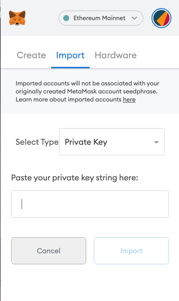
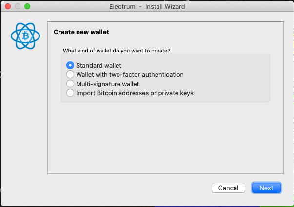
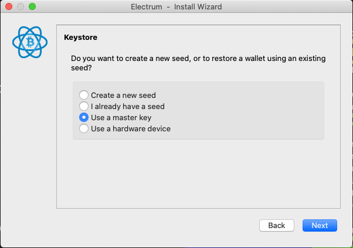
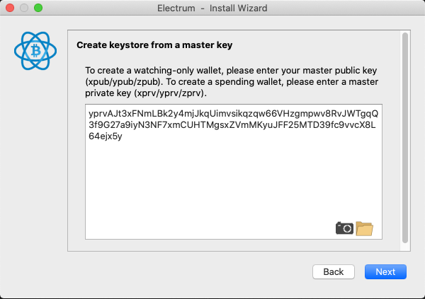
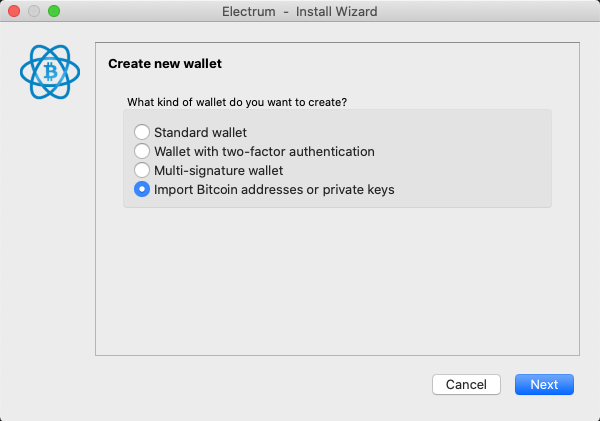
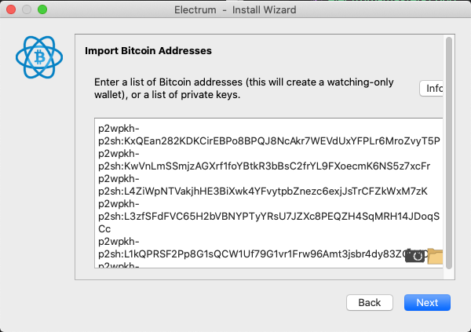

# safecard-cli

A CLI for interacting with a GridPlus SafeCard through an HID card reader. Runs on both Windows and MacOS with a USB HID card reader attached. Here's an example of an [HID USB card reader](https://www.amazon.com/HID-OMNIKEY-3121-Card-Reader/dp/B00AT4NX8S/ref=sr_1_14?dchild=1&keywords=hid+reader&qid=1611873802&sr=8-14). Note that you must obtain a *contact* HID reader, i.e. one in which you can insert your SafeCard.

## Installation

First download a binary from our [releases page](https://github.com/GridPlus/safecard-cli/releases/tag/latest). Please choose the correct binary for your system:

| OS    | Binary |
|:------|:-------|
| MacOS | safecard-cli |
| Windows | safecard-cli.exe |

Once downloaded, you can run the binary from the download directory with:

```
./safecard-cli
```

### Building from Source

If you want to build from source instead, you can clone this repo and run one of the following.

**Mac/Linux**

```
make build
```

**Windows**

```
make windows-build
```

## Usage

Before running `safecard-cli`, ensure you have a valid GridPlus SafeCard inserted into an HID reader.

### Delete Seed

Delete the SafeCard's wallet seed. This operation is irreversible. It will return your SafeCard to a pre-wallet state. If you insert the SafeCard into a Lattice after deleting the seed, the Lattice will prompt you to create another wallet on the SafeCard.

```
safecard-cli deleteSeed
```

### Export Seed

Export the card's master wallet seed as a binary seed represented in hex. This hex seed can be used to derive wallet private keys and addresses. Note that this is **not a seed phrase**; it is instead a hash of your seed phrase. You will likely have difficulty finding third party wallet software that you can use to import this seed directly. However, you can keep this seed somewhere safe and import it to another SafeCard at a later date (load seed not yet implemented).

```
safecard-cli exportSeed
```

### Export Private Keys

Export one or more private keys from the card. **These keys are generally more useful if you want to import your SafeCard wallet into a 3rd party wallet.**

```
safecard-cli exportPriv
```

**Options**

This command has several options, which you can access with:

```
safecard-cli exportPriv --help
```

#### Ethereum

The exported Ethereum private key(s) (printed as hexadecimal strings) may be pasted directly into [MetaMask](https://metamask.io). By default, the Lattice only uses the first key, so you can simply run:

```
safecard-cli exportPriv --coin ETH
```

You can paste the result of that into MetaMask:



#### Bitcoin

For Bitcoin we offer export of the master key for use in [Electrum](https://electrum.org/#home) (recommended) as well as different types of individual account private keys.

#### (Recommended) Master Key (Electrum)

If you wish to import a full hierarchical deterministic (HD) wallet into Bitcoin wallet software, we highly recommend exporting the "master private key" and importing it into [Electrum](https://electrum.org/#home).

> Note that the exported key is compatible with Electrum but probably not with anything else. Electrum expects a master key that is derived at the path `m/49'/0'/0'`, whereas usually "master key" refers to an underived key.

```
safecard-cli exportPriv --electrum-master-priv
```

You can use the result of that to create an HD wallet in Electrum:





#### Account Keys (Electrum)

You can also export individual (i.e. "account") private keys for import into Electrum. By specifying Electrum import, `safecard-cli` will prefix the keys as needed. Using the `--electrum` also sets `--wif`, as Electrum only allows import of [WIF](https://en.bitcoin.it/wiki/Wallet_import_format) formatted private keys.

> Note: Electrum sometimes imports keys out of order and we don't really know why, but it doesn't affect use.

```
safecard-cli exportPriv --num-keys 20 --electrum
```




### Account Keys

If you want individual keys exported as raw strings, just don't set the `electrum` flag. You can export the keys themselves either as hex (default) or in WIF with the `--wif` tag:

```
safecard-cli exportPriv
```

```
safecard-cli exportPriv --wif
```


## Development

### Run development version
In development, the CLI can be run directly without first building a binary by running it like so:
```
go run main.go exportSeed
```
### Adding a new CLI command
In order to develop a new command for the CLI (e.g. exportSeed or deleteSeed) one should use the cobra autogenerate tool to set up a preformatted file under the cmd/ directory, by using the command below.
```
cobra add $commandName
```

This will autogenerate the necessary file under the cmd/ directory for the new shell command
Further details on the cobra generator here: https://github.com/spf13/cobra/blob/master/cobra/README.md